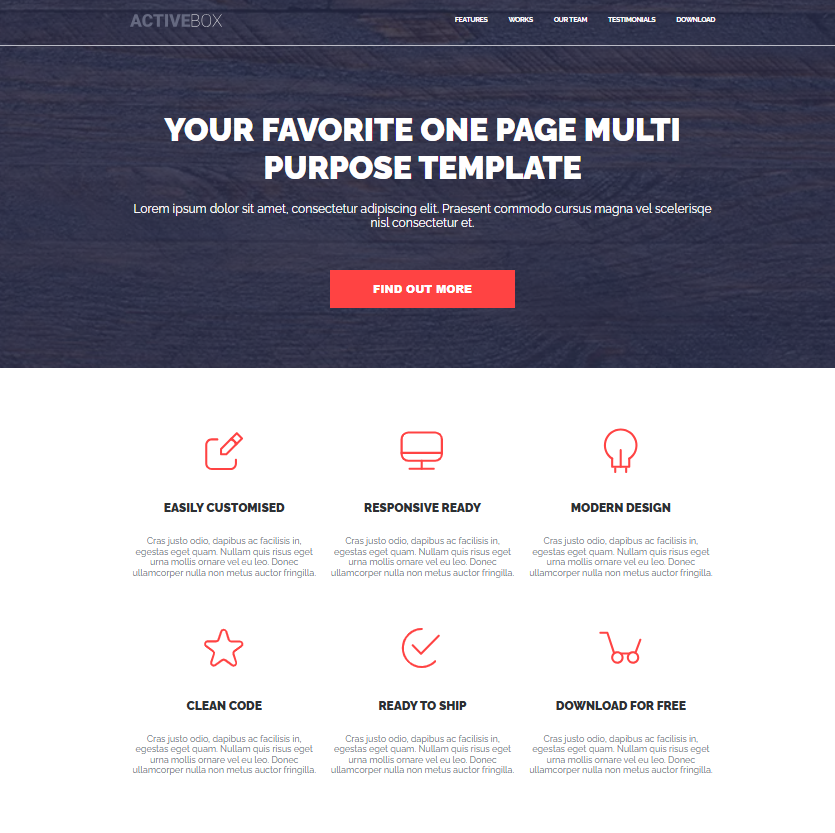
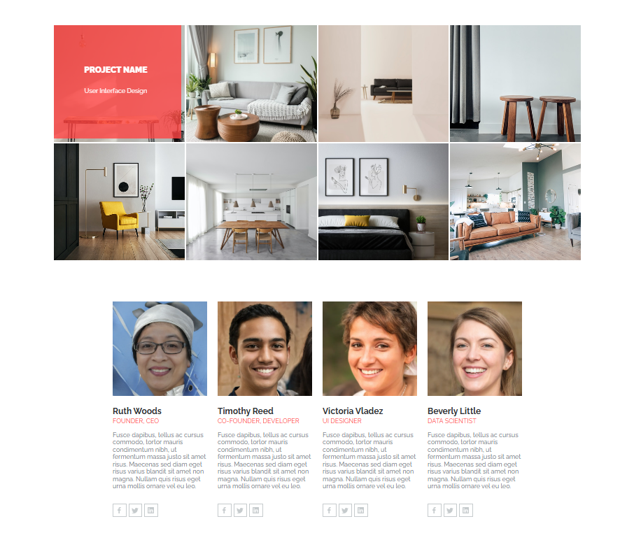
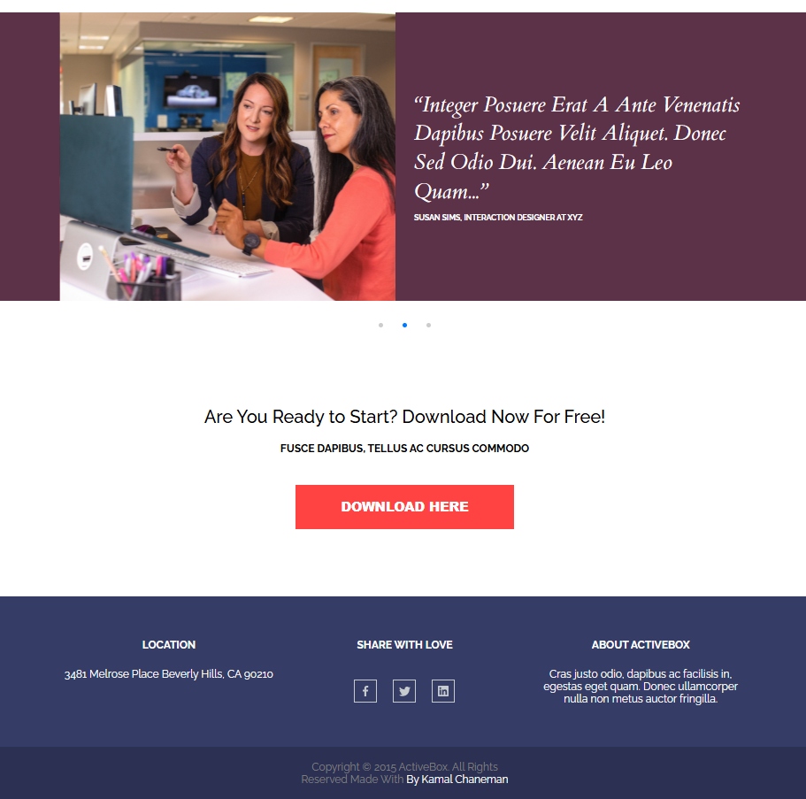

# ActiveBox

Responsive landing page based on the ActiveBox design.

## Technologies

- HTML5
- SCSS
- CSS Grid
- Flexbox
- BEM methodology
- Swiper.js
- Responsive design

## Features

- Responsive layout
- Mobile navigation
- Image hover effects
- Testimonials slider
- CSS animations

## Responsive

The layout is adapted for:
- Desktop
- Tablet
- Mobile

## Author

Alesia Katsuba